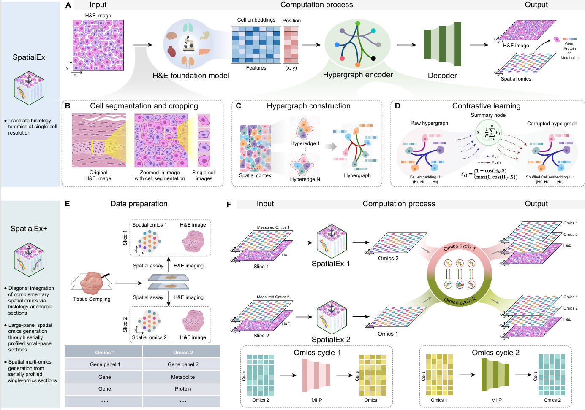

Welcome to the SpatialEx tutorial!
========================================

.. SpatialEx tutorial master file, created by
   sphinx-quickstart on Thu Sep 16 19:43:51 2021.
   You can adapt this file completely to your liking, but it should at least
   contain the root `toctree` directive.

High-Parameter Spatial Multi-Omics through Histology-Anchored Integration
=====================================================================================================================================================

.. toctree::
   :maxdepth: 1
   :caption: Contents:
   
   Installation
   Tutorial 1_data SpatialEx Translates Histology to Omics at Single-Cell Resolution
   Tutorial 2_data SpatialEx+ Enables Larger Panel Spatial Analysis through Panel Diagonal Integration
   Tutorial 3_data Scalability on Million-Cell Tissue Sections
   Tutorial 4_data SpatialEx+ Enables Spatial Multi-omics through Omics Diagonal Integration
   Tutorial 5_data SpatialEx+ is Robust Even When There is Weak or No Overlap between Slices

Overview
========
Recent advances in spatial omics technologies enable in situ molecular profiling while preserving spatial context but face fundamental challenges in achieving high-parameter and multi-omics co-profiling. Spatially resolving complementary panels or distinct omics layers across serial tissue sections circumvents technical trade-offs but introduces the spatial diagonal integration problem: reconstructing unified multi-omics states when datasets lack shared molecular features. To address this critical challenge, we present SpatialEx and its extension SpatialEx+, computational frameworks that leverage histology as a universal anchor to integrate spatial molecular data across tissue sections. The foundational SpatialEx model combines a pre-trained H&E foundation model with hypergraph learning and contrastive learning to predict single-cell omics profiles from histology, encoding multi-neighborhood spatial dependencies and global tissue context. Building upon SpatialEx, SpatialEx+ introduces an omics cycle module that encourages cross-omics consistency across adjacent sections via slice-invariant mapping functions, achieving seamless diagonal integration without requiring co-measured multi-omics data for training. Through rigorous validation across three key applications, we demonstrate: (1) H&E-to-omics prediction at single-cell resolution, characterizing tumor microenvironments beyond sequencing borders in breast cancer; (2) panel diagonal integration, merging non-overlapping spatial gene panels from different slices to resolve immune-stromal boundaries lost by individual panels; and (3) omics diagonal integration, revealing Parkinson’s disease anatomical domains and context-specific tissue pathologies through integrated transcriptomic-metabolic analysis. The framework scales to datasets exceeding one million cells, maintains robustness with non-overlapping or heterogeneous sections, and supports unlimited omics layers in principle. By transforming highly feasible spatial single-omics assays with histology into a holistic spatial multi-omics map, our work democratizes systems-level tissue analysis, bridging fundamental spatial biology and scalable multi-omics research with minimal experimental overhead. 

Citation
========
x
